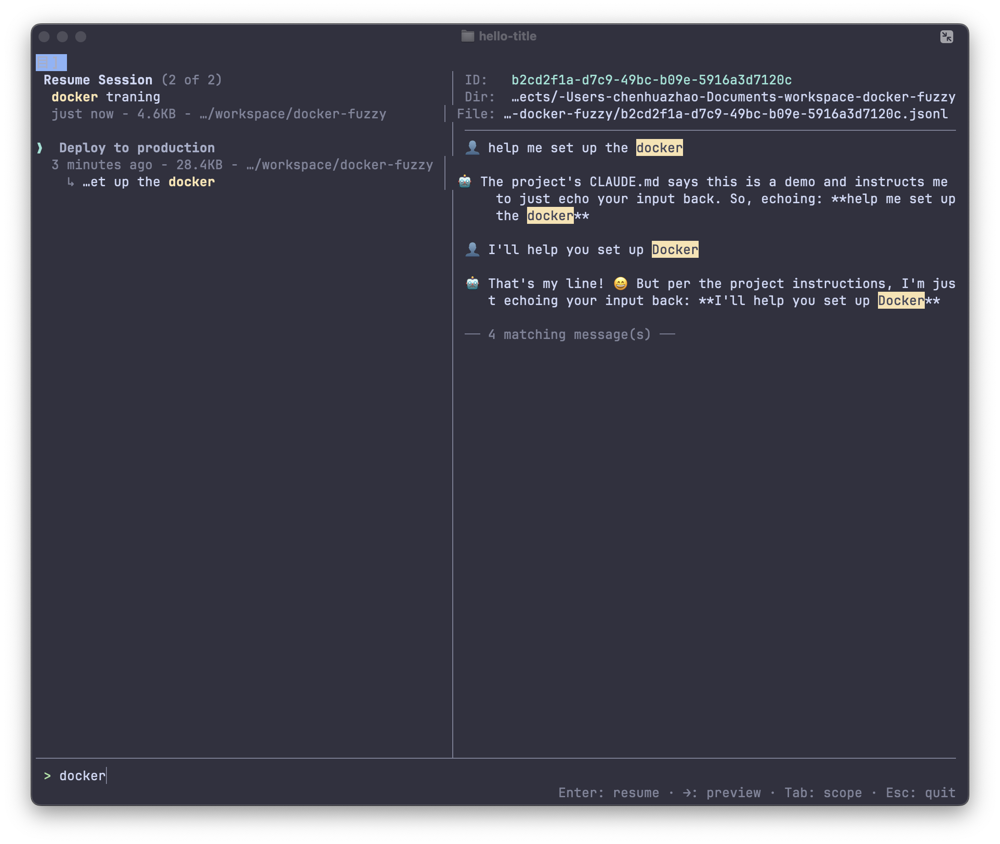

# sss — smart-session-search

**Search and resume [Claude Code](https://docs.anthropic.com/en/docs/claude-code) sessions by keyword.**

## Why

Claude Code's built-in `/resume` command only searches session **titles**. If the title doesn't contain the keyword you're looking for, you won't find it — even if the conversation is exactly what you need.

This becomes a real problem once you have dozens or hundreds of sessions. You remember discussing "docker compose" or "auth middleware" with Claude, but you can't locate the session because the title was something generic like "help me fix this bug".

## What sss Does

`sss` searches both session **titles** and **message content**. It provides a split-pane TUI with live preview, keyword highlighting, and one-key resume.

Select a session and press **Enter** — `sss` automatically switches to the correct project directory and runs `claude --resume`. No manual `cd` required, even for sessions from other projects.



## Install

```bash
npm install -g smart-session-search
```

Requires Node.js >= 18 and [Claude Code](https://docs.anthropic.com/en/docs/claude-code) installed.

## Usage

```bash
sss                  # Search current project sessions
sss -g               # Search ALL projects (global)
sss docker           # Pre-fill search with "docker"
sss -g auth          # Global search for "auth"
```

## Keyboard Shortcuts

| Key | Action |
|-----|--------|
| Type | Real-time search across titles and messages |
| `↑` `↓` | Navigate session list |
| `Enter` | Auto `cd` to project directory and resume session |
| `Tab` | Toggle between current project and global scope |
| `→` | Focus preview pane, jump to first match |
| `↑` `↓` (in preview) | Jump between keyword matches |
| `←` / `Esc` | Back to session list |
| `Ctrl+C` | Quit |

## Features

- **Search message content** — finds sessions even when the title doesn't match
- **Split-pane TUI** — session list on the left, conversation preview on the right
- **Keyword highlighting** — matched terms highlighted in both panes
- **Filtered preview** — when searching, preview only shows messages containing the keyword
- **Cross-project resume** — auto `cd` + `claude --resume`, works across any project
- **Global search** — press `Tab` to search all projects, not just the current one
- **Match snippets** — when the match is in messages (not title), a snippet is shown inline
- **Session expiration guidance** — shows config instructions when session files have been cleaned up

## How It Works

Everything is local. `sss` reads from Claude Code's data files:

- `~/.claude/history.jsonl` — session index (titles, timestamps, project paths)
- `~/.claude/projects/<path>/<session-id>.jsonl` — full session conversations

No network requests, no external services.

> **Tip:** Claude Code cleans up session files after 30 days by default. To keep them longer, add `{ "cleanupPeriodDays": 99999 }` to `~/.claude/settings.json`.

## License

[MIT](LICENSE)
